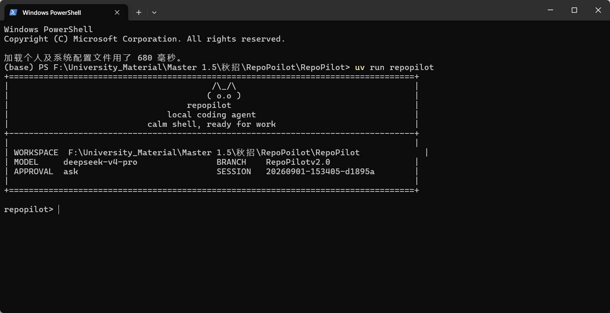
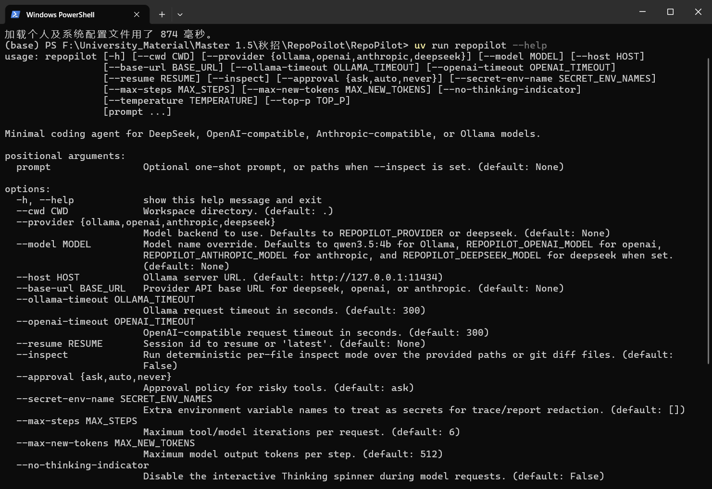

# RepoPilot

语言：[English](README.md) | [简体中文](README.zh-CN.md)

RepoPilot 是一个面向本地 Git 仓库的轻量级 coding agent。它运行在终端中，让大模型通过受约束的工具读取文件、搜索代码、执行命令、修改文件，并把会话历史、运行轨迹、检查点和报告都保存在本地，方便继续上一次任务。

这个项目刻意保持轻量：没有依赖 LangGraph 或重型编排框架。RepoPilot 把 agent loop 显式写在 runtime 里，使工具执行、审批、事件日志、上下文预算和恢复逻辑都能作为普通 Python 代码被测试和解释。

## 截图

启动界面：



交互式帮助：



## 能做什么

- 在回答问题前理解当前本地仓库结构。
- 通过受控工具完成目录查看、文件读取、代码搜索、shell 命令、文件写入、补丁修改和只读子任务调查。
- 在终端里显示模型思考中、正在运行哪个工具、正在读取哪个文件等反馈。
- 将 session history、memory、checkpoint、trace、report 和 coverage artifact 持久化到 `.repopilot/`。
- 支持通过 `--resume latest` 或指定 session id 接续之前的会话。
- 支持 DeepSeek、OpenAI-compatible、Anthropic-compatible 和 Ollama 后端。

## 为什么做这个项目

很多 coding-agent demo 把核心 runtime 隐藏在自然语言 prompt 里。RepoPilot 更关注模型外侧的工程边界：

- 工具调用有显式 schema 和参数校验。
- 工具结果同时包含给模型看的文本和给 trace/report 使用的结构化 metadata。
- 重复的等价工具调用会在执行前被拒绝，避免浪费工具步数。
- shell 输出按 bytes 捕获并显式解码，避免 Windows GBK/UTF-8 混用导致中文源码或日志读取崩溃。
- runtime history 从 append-only session event log 投影生成，而不是只依赖可变的内存状态。

这些设计让 agent 更容易审计、测试、恢复，也更容易在面试中解释清楚。

## 核心架构

```text
CLI
  -> Workspace snapshot
  -> Model client
  -> AgentLoop
       -> 从 projected history + memory + context budget 构建 prompt
       -> 请求模型给出下一步动作
       -> 解析 tool call 或 final answer
       -> 校验并执行工具
       -> 追加 event log + trace + checkpoint
       -> 循环直到 final answer 或达到 step limit
```

主要模块：

| 模块领域 | 文件 |
| --- | --- |
| CLI 和模型后端装配 | `repopilot/cli.py`, `repopilot/providers/` |
| Agent 主循环 | `repopilot/agent_loop.py`, `repopilot/runtime.py` |
| 工具协议 | `repopilot/tools.py`, `repopilot/tool_executor.py`, `repopilot/tool_context.py` |
| 上下文管理 | `repopilot/context_manager.py`, `repopilot/context_compression.py` |
| 事件日志和运行产物 | `repopilot/session_log.py`, `repopilot/event_log.py`, `repopilot/run_store.py` |
| Checkpoint 和 resume | `repopilot/checkpoint.py`, `repopilot/task_state.py` |
| 记忆提升 | `repopilot/memory_promotion.py`, `repopilot/features/memory.py` |
| 实验和指标 | `scripts/`, `repopilot/evaluation/`, `docs/metrics/` |

## 关键特性

### Schema-First 工具边界

RepoPilot 暴露一组小而明确的工具白名单。每个工具声明参数 schema，在执行前校验参数，并返回模型可读文本和机器可读 metadata。这样 runtime 不需要靠脆弱的字符串解析来判断 exit code、工具状态或报告指标。

### Append-Only Event Log

当前 run 的 history、trace 和 report 数据都从本地 append-only event log 投影生成。这个设计提供了可重放、可审计、可测试的事实来源，避免只把一段 prompt 或可变 session 缓存当成唯一运行记录。

### 上下文预算管理

ContextManager 会从 workspace 信息、projected history、memory 和当前请求中构建 prompt。在长上下文压力下，它会保留当前请求，同时压缩旧的或低优先级上下文。

最新 deterministic 长上下文压力测试：

| 指标 | 结果 |
| --- | ---: |
| 配置数量 | 12 |
| 原始 prompt 平均长度 | 6,959 chars |
| 管理后 prompt 平均长度 | 5,541 chars |
| 平均压缩率 | 16.43% |
| 最高压缩率 | 33.72% |
| 当前请求保留率 | 100% |

来源：`docs/metrics/latest-long-context-stress.md`。

### Durable Memory Promotion

RepoPilot 把候选记忆抽取和长期记忆写入分开处理。候选事实需要经过评分、去重、冲突检测和敏感信息过滤后，才会被提升为 durable memory。

记忆提升 benchmark：

| 指标 | 结果 |
| --- | ---: |
| 候选事实数量 | 180 |
| 类别数量 | 6 |
| 提升为可复用记忆 | 90 |
| 拒绝不安全/噪声事实 | 60 |
| 冲突事实进入确认状态 | 30 |
| SAVE 策略敏感泄露数 | 0 |

来源：`docs/metrics/p7-memory-promotion-experiment.md`。

### Checkpoint 和 Resume

RepoPilot 会在关键 runtime 事件后写入本地 checkpoint。后续会话可以恢复之前的 history、memory、context-compression state 和 workspace drift 信息。

```bash
uv run repopilot --resume latest
```

## 安装

RepoPilot 需要 Python 3.10+。

```bash
uv sync
```

也可以使用 editable 模式安装：

```bash
pip install -e .
```

## 配置

复制环境变量示例文件：

```bash
cp .env.example .env
```

只填写你要使用的 provider key。`.env` 已经被 Git 忽略，不应该提交真实密钥。

默认 provider 选择优先级：

```text
CLI --provider > REPOPILOT_PROVIDER > deepseek
```

支持的 provider：

| Provider | 示例 |
| --- | --- |
| DeepSeek Anthropic-compatible | `uv run repopilot --provider deepseek` |
| OpenAI-compatible Responses API | `uv run repopilot --provider openai` |
| Anthropic-compatible Messages API | `uv run repopilot --provider anthropic` |
| Ollama 本地模型 | `uv run repopilot --provider ollama --model qwen3.5:4b` |

## 使用方式

启动交互式终端 agent：

```bash
uv run repopilot
```

指定工作目录：

```bash
uv run repopilot --cwd /path/to/repo
```

执行一次性任务：

```bash
uv run repopilot "inspect the failing tests and propose a fix"
```

面对较大的仓库理解任务，可以提高最大工具/模型迭代次数：

```bash
uv run repopilot --max-steps 10
```

恢复最近一次会话：

```bash
uv run repopilot --resume latest
```

常用 REPL 命令：

| 命令 | 作用 |
| --- | --- |
| `/help` | 查看内置命令 |
| `/memory` | 查看提炼后的工作记忆 |
| `/session` | 打印当前会话文件路径 |
| `/reset` | 清空当前会话 history 和 memory |
| `/exit` | 退出 REPL |

## 本地产物

RepoPilot 会把运行产物写到 `.repopilot/`：

```text
.repopilot/sessions/        saved sessions
.repopilot/runs/<run_id>/   task_state.json, trace.jsonl, report.json
```

这些文件只用于本地运行，默认不会提交。个人笔记、对比参考仓库、简历、本地 scratch 目录和 provider 密钥也都被 `.gitignore` 排除。

## 开发

运行测试：

```bash
uv run pytest tests -q
```

修改 runtime 边界时常用的重点测试：

```bash
uv run pytest tests/test_tools.py tests/test_tool_executor.py tests/test_agent_loop.py -q
```

运行长上下文实验：

```bash
uv run python scripts/run_large_scale_experiments.py
```

运行记忆提升实验：

```bash
uv run python scripts/run_memory_promotion_experiment.py
```

## 项目状态

RepoPilot 是一个作品集级别的 agent runtime 项目。它重点展示 coding agent 外层工程能力：工具安全、结构化工具结果、event-log replay、上下文预算、记忆提升、checkpoint/resume 和可度量的回归测试。
